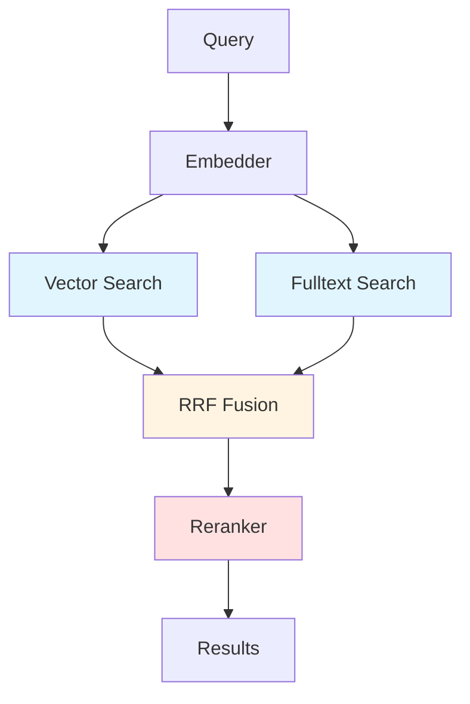
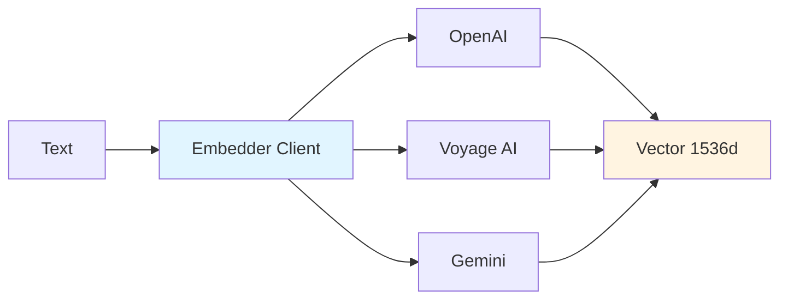
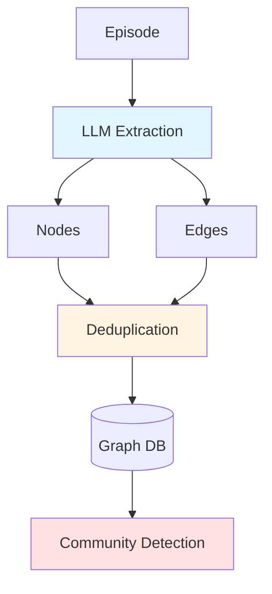
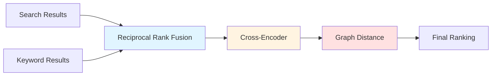
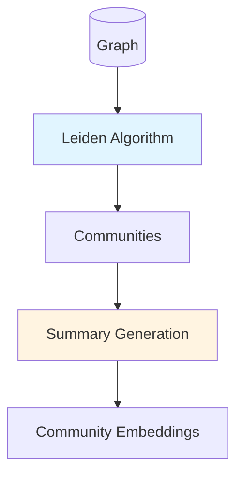

# Contributing to Graphiti: Improvement Verticals

This guide outlines key areas for enhancement in Graphiti's knowledge graph framework, focusing on RAG optimization and applied AI verticals. Each section provides research-backed optimization paths with implementation guidance.

## Table of Contents

1. [Search & Retrieval Optimization](#search--retrieval-optimization)
2. [Embedding & Representation Learning](#embedding--representation-learning)
3. [Graph Construction & Evolution](#graph-construction--evolution)
4. [Reranking & Fusion Strategies](#reranking--fusion-strategies)
5. [Community Detection & Clustering](#community-detection--clustering)
6. [Integration Opportunities](#integration-opportunities)
7. [Setup & Configuration](#setup--configuration)

---

## Search & Retrieval Optimization

### Current Architecture



### Optimization Paths

| Vertical | Current State | Enhancement Opportunity | Research |
|----------|--------------|------------------------|----------|
| **Hybrid Search** | RRF-based fusion of semantic + keyword | Implement learned fusion weights, query-adaptive routing | [Learned Sparse Retrieval](https://arxiv.org/abs/2112.08118) |
| **Query Expansion** | Single query embedding | Multi-query expansion, HyDE (Hypothetical Document Embeddings) | [Query2doc](https://arxiv.org/abs/2303.07678), [HyDE](https://arxiv.org/abs/2212.10496) |
| **Graph-Aware Search** | BFS with distance reranking | PageRank-based importance, personalized graph traversal | [Graph-based RAG](https://arxiv.org/abs/2404.16130) |
| **Temporal Awareness** | Time-based filtering | Temporal decay functions, recency bias tuning | [Temporal Knowledge Graphs](https://arxiv.org/abs/2501.13956) |

### Implementation Priorities

1. **Query Expansion Pipeline**
   - Add HyDE-style query transformation before embedding
   - Implement multi-vector query generation
   - Location: `graphiti_core/search/search_utils.py`

2. **Adaptive Fusion**
   - Replace static RRF with learned weights
   - Query-type classification for search strategy selection
   - Location: `graphiti_core/search/search.py`

3. **Graph Traversal Enhancement**
   - Implement personalized PageRank scoring
   - Add multi-hop reasoning paths
   - Location: `graphiti_core/search/search_utils.py` (BFS functions)

---

## Embedding & Representation Learning

### Current Architecture



### Optimization Paths

| Vertical | Current State | Enhancement Opportunity | Research |
|----------|--------------|------------------------|----------|
| **Multi-Representation** | Single embedding per entity | Contrastive entity/relation embeddings, aspect-based embeddings | [CoLBERT](https://arxiv.org/abs/2004.12832), [E5](https://arxiv.org/abs/2212.03533) |
| **Fine-tuning** | Off-the-shelf embeddings | Domain-adaptive fine-tuning on graph structure | [Sentence Transformers](https://arxiv.org/abs/1908.10084) |
| **Dimensionality** | Fixed 1536d | Matryoshka embeddings for adaptive dimensions | [Matryoshka Embeddings](https://arxiv.org/abs/2205.13147) |
| **Contextualized Embeddings** | Static entity embeddings | Graph-contextualized node embeddings | [GraphSAGE](https://arxiv.org/abs/1706.02216) |

### Implementation Priorities

1. **Multi-Vector Embeddings**
   - Entity + context separate embeddings
   - Location: `graphiti_core/embedder/client.py`
   ```python
   async def embed_multi_aspect(text: str, aspects: list[str]) -> dict[str, list[float]]:
       """Generate aspect-specific embeddings for nuanced retrieval"""
       pass
   ```

2. **Local Model Integration**
   - Add sentence-transformers backend for on-prem deployment
   - Location: `graphiti_core/embedder/sentence_transformers.py`
   - Use models: `sentence-transformers/all-MiniLM-L6-v2` (compact), `BAAI/bge-large-en-v1.5` (performance)

3. **Adaptive Embedding Dimensions**
   - Support Matryoshka-style truncation for speed/accuracy tradeoffs
   - Configuration in `graphiti_core/embedder/client.py`

---

## Graph Construction & Evolution

### Current Architecture



### Optimization Paths

| Vertical | Current State | Enhancement Opportunity | Research |
|----------|--------------|------------------------|----------|
| **Entity Resolution** | LLM-based string matching | Embeddings-based similarity, active learning for conflicts | [Entity Alignment](https://arxiv.org/abs/2206.13163) |
| **Relation Extraction** | Prompted LLM extraction | Few-shot learning, relation type ontology | [Few-shot Relation Extraction](https://arxiv.org/abs/2010.13415) |
| **Incremental Updates** | Full episode processing | Delta-based graph updates, change detection | [Incremental Learning](https://arxiv.org/abs/2302.05698) |
| **Schema Evolution** | Fixed schema | Dynamic ontology expansion, type discovery | [Open Knowledge Graphs](https://arxiv.org/abs/2210.00305) |

### Implementation Priorities

1. **Semantic Entity Deduplication**
   - Augment string matching with embedding similarity
   - Location: `graphiti_core/utils/bulk_utils.py` (dedupe_nodes_bulk)
   ```python
   def dedupe_with_embeddings(nodes: list[EntityNode], threshold: float = 0.95) -> list[EntityNode]:
       """Use cosine similarity on embeddings for fuzzy matching"""
       pass
   ```

2. **Structured Output for Extraction**
   - Use JSON schema validation for consistent extraction
   - Leverage tools like [Instructor](https://github.com/jxnl/instructor) for type-safe LLM outputs
   - Location: `graphiti_core/utils/maintenance/node_operations.py`

3. **Change Detection Pipeline**
   - Track entity attribute changes over time
   - Implement diff-based updates
   - Location: New file `graphiti_core/utils/maintenance/change_tracking.py`

---

## Reranking & Fusion Strategies

### Current Architecture



### Optimization Paths

| Vertical | Current State | Enhancement Opportunity | Research |
|----------|--------------|------------------------|----------|
| **Cross-Encoder Models** | OpenAI reranker | Local cross-encoders (ms-marco, bge-reranker), listwise reranking | [BGE Reranker](https://arxiv.org/abs/2309.07597) |
| **Fusion Methods** | RRF only | CombSUM, CombMNZ, learned-to-rank | [Rank Fusion Survey](https://arxiv.org/abs/2207.07461) |
| **Diversity** | Greedy top-k | MMR (Maximal Marginal Relevance), DPP (Determinantal Point Processes) | [MMR](https://www.cs.cmu.edu/~jgc/publication/The_Use_MMR_Diversity_Based_LTMIR_1998.pdf) |
| **Contextual Reranking** | Query-document only | Include graph context, temporal signals | [Contextual Reranking](https://arxiv.org/abs/2305.02524) |

### Implementation Priorities

1. **Local Cross-Encoder Support**
   - Add `sentence-transformers/ms-marco-MiniLM-L-12-v2` backend
   - Location: `graphiti_core/cross_encoder/` (new file `local_reranker.py`)
   ```python
   class LocalCrossEncoder(CrossEncoderClient):
       """Local reranker using sentence-transformers"""
       def __init__(self, model_name: str = 'cross-encoder/ms-marco-MiniLM-L-12-v2'):
           from sentence_transformers import CrossEncoder
           self.model = CrossEncoder(model_name)
   ```

2. **Learned Fusion Weights**
   - Train lightweight ranker on user feedback
   - Configuration in `graphiti_core/search/search_config.py`

3. **Diversity-Aware Ranking**
   - Implement MMR in `graphiti_core/search/search_utils.py` (already exists - enhance)
   - Add coverage-based diversity metrics

---

## Community Detection & Clustering

### Current Architecture



### Optimization Paths

| Vertical | Current State | Enhancement Opportunity | Research |
|----------|--------------|------------------------|----------|
| **Hierarchical Communities** | Single-level | Multi-resolution hierarchies, nested communities | [Hierarchical Clustering](https://arxiv.org/abs/1810.08473) |
| **Dynamic Communities** | Batch recalculation | Incremental community updates, temporal stability | [Dynamic Graphs](https://arxiv.org/abs/2101.05974) |
| **Embedding-Aware** | Structure-only | Combine topology + embeddings for clustering | [Deep Graph Clustering](https://arxiv.org/abs/2211.12875) |
| **Summarization** | LLM abstractive | Extractive summaries, key entity identification | [Graph Summarization](https://arxiv.org/abs/2203.01849) |

### Implementation Priorities

1. **Hierarchical Community Detection**
   - Multi-level Leiden with configurable resolution
   - Location: `graphiti_core/utils/maintenance/community_operations.py`

2. **Incremental Community Updates**
   - Track edge additions/deletions for local community updates
   - Avoid full recomputation on small changes

3. **Community Quality Metrics**
   - Add modularity, conductance, coverage metrics
   - Enable A/B testing of detection algorithms

---

## Integration Opportunities

### LangChain MCP Adapter

[langchain-mcp-adapter](https://github.com/rectalogic/langchain-mcp-adapter) enables LangChain integration with MCP servers.

**Use Case**: Expose Graphiti as a LangChain tool for agent workflows

```python
from langchain_mcp_adapter import MCPClientAdapter
from langchain.agents import initialize_agent

# Wrap Graphiti MCP server
graphiti_tool = MCPClientAdapter(
    server_path="mcp_server",
    tool_name="graphiti_memory"
)

agent = initialize_agent([graphiti_tool], llm, agent_type="openai-functions")
```

**Implementation**: 
- Location: `examples/langchain_integration/`
- Add LangChain-compatible tool wrappers
- Document in `examples/langchain_integration/README.md`

### Toon for Structured Data

[Toon](https://github.com/anthropics/anthropic-tools/tree/main/toon) provides structured representation of complex data.

**Use Case**: Visualize and debug knowledge graph state during development

```python
from toon import Display

# Visualize graph neighborhood
neighborhood = await graphiti.search(query="person:Alice", config=EDGE_SEARCH)
Display(neighborhood).render()
```

**Implementation**:
- Location: `graphiti_core/utils/visualization.py`
- Add Toon-compatible serialization for nodes/edges
- Include in dev dependencies

### Additional Tools

| Tool | Purpose | Integration Point |
|------|---------|-------------------|
| [LlamaIndex](https://github.com/run-llama/llama_index) | Alternative RAG framework | Custom retriever using Graphiti backend |
| [DSPy](https://github.com/stanfordnlp/dspy) | Prompt optimization | Optimize extraction prompts in `graphiti_core/prompts/` |
| [Semantic Kernel](https://github.com/microsoft/semantic-kernel) | Agent orchestration | Plugin for Graphiti memory functions |
| [Instructor](https://github.com/jxnl/instructor) | Structured LLM outputs | Type-safe entity/relation extraction |
| [LiteLLM](https://github.com/BerriAI/litellm) | Unified LLM API | Abstract LLM client implementations |

---

## Setup & Configuration

### Environment Variables

Update your `.env` file with required keys:

```bash
# LLM Providers (choose one or more)
OPENAI_API_KEY=sk-...
ANTHROPIC_API_KEY=sk-ant-...
GOOGLE_API_KEY=...           # For Gemini

# Embedding Providers (choose one)
OPENAI_API_KEY=sk-...        # For OpenAI embeddings
VOYAGE_API_KEY=...           # For Voyage embeddings
GEMINI_API_KEY=...           # For Gemini embeddings

# Graph Database (choose one)
NEO4J_URI=bolt://localhost:7687
NEO4J_USER=neo4j
NEO4J_PASSWORD=password

# Alternative: FalkorDB
FALKORDB_URI=redis://localhost:6379
FALKORDB_USER=default
FALKORDB_PASSWORD=

# Alternative: Neptune (AWS)
NEPTUNE_ENDPOINT=...
NEPTUNE_PORT=8182
AWS_REGION=us-east-1

# Optional: Cross-Encoder Reranker
OPENAI_API_KEY=sk-...        # For OpenAI reranker

# Optional: Performance tuning
USE_PARALLEL_RUNTIME=true
SEMAPHORE_LIMIT=10
MAX_REFLEXION_ITERATIONS=3

# Optional: Tracing
ENABLE_TRACING=false
OTEL_EXPORTER_OTLP_ENDPOINT=http://localhost:4318
```

### Verification

Check that your setup is complete:

```bash
# Install dependencies
make install

# Run unit tests (no API keys needed)
make test

# Run integration tests (requires API keys + graph DB)
export TEST_OPENAI_API_KEY=$OPENAI_API_KEY
export TEST_URI=$NEO4J_URI
export TEST_USER=$NEO4J_USER
export TEST_PASSWORD=$NEO4J_PASSWORD
make test-integration
```

### Quick Start with Minimal Setup

For rapid experimentation, use OpenAI + Neo4j local:

```bash
# 1. Start Neo4j with Docker
docker-compose up -d

# 2. Set minimal env vars
export OPENAI_API_KEY=sk-...
export NEO4J_URI=bolt://localhost:7687
export NEO4J_USER=neo4j
export NEO4J_PASSWORD=password

# 3. Run quickstart
python examples/quickstart/quickstart_neo4j.py
```

---

## Contributing Your Improvements

### Workflow

1. **Identify Vertical**: Choose from the optimization paths above
2. **Research**: Review cited papers and related work
3. **Design**: Create RFC issue for major changes (>500 LOC)
4. **Implement**: Follow existing patterns in codebase
5. **Test**: Add unit tests + integration tests with `@pytest.mark.integration`
6. **Document**: Update docstrings, add example usage
7. **Benchmark**: Compare performance vs. baseline (if applicable)

### Code Quality

```bash
# Before submitting PR
make format  # Ruff formatting
make lint    # Ruff + Pyright checks
make test    # Pytest suite
```

### Example Contributions

**Small (Good First Issue)**
- Add new embedding provider (e.g., Cohere)
- Implement alternative fusion method (CombSUM)
- Add graph visualization utility

**Medium**
- Local cross-encoder reranker
- HyDE query expansion
- Hierarchical community detection

**Large (Requires RFC)**
- Multi-vector embedding architecture
- Learned-to-rank fusion
- Real-time incremental graph updates

---

## Research References

### Core Graphiti Architecture
- [Zep: Temporal Knowledge Graph Architecture](https://arxiv.org/abs/2501.13956) - Foundational paper

### Retrieval & RAG
- [HyDE: Hypothetical Document Embeddings](https://arxiv.org/abs/2212.10496)
- [Query2doc: Query Expansion with Large Language Models](https://arxiv.org/abs/2303.07678)
- [Graph-based RAG](https://arxiv.org/abs/2404.16130)
- [Learned Sparse Retrieval](https://arxiv.org/abs/2112.08118)

### Embeddings
- [E5: Text Embeddings by Contrastive Pre-training](https://arxiv.org/abs/2212.03533)
- [Matryoshka Representation Learning](https://arxiv.org/abs/2205.13147)
- [ColBERT: Efficient and Effective Passage Search](https://arxiv.org/abs/2004.12832)
- [Sentence-BERT: Sentence Embeddings using Siamese BERT](https://arxiv.org/abs/1908.10084)

### Reranking
- [BGE Reranker](https://arxiv.org/abs/2309.07597)
- [Rank Fusion in Information Retrieval](https://arxiv.org/abs/2207.07461)
- [Contextual Reranking](https://arxiv.org/abs/2305.02524)

### Graph Methods
- [GraphSAGE: Inductive Representation Learning](https://arxiv.org/abs/1706.02216)
- [Hierarchical Graph Clustering](https://arxiv.org/abs/1810.08473)
- [Dynamic Graph Learning](https://arxiv.org/abs/2101.05974)
- [Deep Graph Clustering](https://arxiv.org/abs/2211.12875)

### Knowledge Graphs
- [Entity Alignment with Knowledge Graphs](https://arxiv.org/abs/2206.13163)
- [Few-shot Relation Extraction](https://arxiv.org/abs/2010.13415)
- [Open Knowledge Graphs](https://arxiv.org/abs/2210.00305)
- [Graph Summarization](https://arxiv.org/abs/2203.01849)

---

## Questions & Support

- **GitHub Issues**: [https://github.com/getzep/graphiti/issues](https://github.com/getzep/graphiti/issues)
- **Discord**: [https://discord.com/invite/W8Kw6bsgXQ](https://discord.com/invite/W8Kw6bsgXQ)
- **Documentation**: [https://help.getzep.com/graphiti](https://help.getzep.com/graphiti)

**Pro Tip**: Before implementing, discuss your approach in Discord or GitHub issues. The community can provide guidance on architecture fit and prevent duplicate work.
